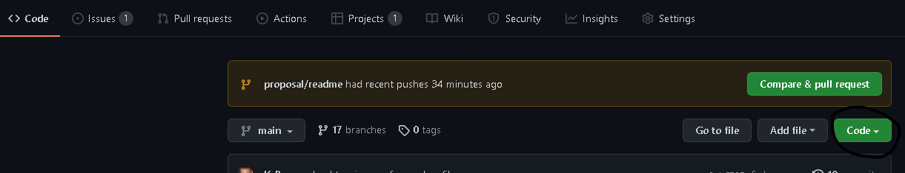
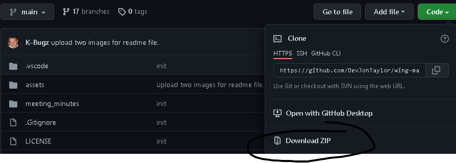
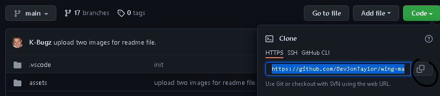

# G.O.A.T. Scale


## Table of Content

- [Description](#Description)
- [Roles](#Roles)
- [Road Map](#Road Map)
- [Deployment](#Deployment)
- [Contributors](#Contributors)
- [License](#License)
- [Outro](#Outro)

## Description
This was a group project to make a fantasy football game called G.O.A.T Scale.
A place where you can still keep the football season alive!! Test your knowledge
on fantasy football!!!


## Roles
### Frontend
- Dominique Akers
- Kevin Bugusky
- John Damaso

### API / JavaScript
- John Damaso
- Jon Taylor

Event thought we are split between the two sides everyone assisted where
they could and helped each other out.  Was a very amazing team experience!

## Road Map
- [x] Light & Dark mode toggle
- [x] Randomly picks a position
- [x] Randomly selects four leaders in that position
- [x] CPU Trash Talk
- [x] Giphy API
- [x] ESPN API
- [x] Determines a winner each round

## Deployment
### Dependencies
- [Bulma](https://bulma.io)
- [Lodash](https://lodash.com/)
- [NodeJS](https://nodejs.org/)
- [Babel](https://babeljs.io/)
- [Webpack](https://webpack.js.org/concepts/)
  - [Boilerplate Used](https://github.com/piecioshka/boilerplate-webpack-babel)
    - Used Babel & Webpack
### Demo
You can access a live version at [GitHub Pages](https://DevJonTaylor.github.io/wing-map)

### Download Zip
1. Go to the repo on [GitHub](https://github.com/DevJonTaylor/wing-map).
2. Click the green code button
   
3. Then click Download Zip button at the bottom.
   - Alternatively you can also [Click Here](https://github.com/DevJonTaylor/wing-map/archive/refs/heads/main.zip)
   
### Clone
1. Head to the [GitHub Repo](https://github.com/DevJonTaylor/wing-map)
2. Click the green code.
   
3. Click the copy button or just highlight and copy the HTTPS url.
   
4. Go to Terminal apply the following command
```bash
git clone https://github.com/DevJonTaylor/wing-map.git
```
## Contributors
- [Dominique Akers](https://github.com/dommy99)
- [John Damaso](https://github.com/JoDamaso)
- [Jon Taylor](https://github.com/DevJonTaylor)
- [Kevin Bugusky](https://github.com/K-Bugz)

## License
[MIT](./LICENSE)

## Outro
This was a great deal of fun, frustration, laughs, and amazing
learning experience.  This app was made with love, sweat, and tears
(from laughing so much!)  Have a great day and thank you for being here.
